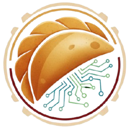

# DumplingChat - System Zarządzania Zamówieniami Restauracyjnymi

<p align="center">
  
</p>

System do zarządzania zamówieniami w restauracji, umożliwiający kelnerom przyjmowanie zamówień, kuchni ich realizację oraz przeglądanie historii.

## 🚀 Szybki Start

### Wymagania
- Node.js 18+ 
- npm lub bun

### Instalacja

```bash
# Sklonuj repozytorium
git clone <YOUR_GIT_URL>

# Przejdź do katalogu projektu
cd <YOUR_PROJECT_NAME>

# Zainstaluj zależności
npm install

# Uruchom serwer deweloperski
npm run dev
```

Aplikacja będzie dostępna pod adresem `http://localhost:5173`

### Budowanie produkcyjne

```bash
npm run build
npm run preview
```

## 📖 Spis Treści

- [Instrukcja Obsługi](#-instrukcja-obsługi)
- [Dokumentacja Techniczna](#-dokumentacja-techniczna)
- [Architektura](#-architektura)
- [Technologie](#-technologie)

---

# 📋 Instrukcja Obsługi

## Strona Główna

Po uruchomieniu aplikacji zobaczysz dashboard z czterema kafelkami:
- **Stanowisko Kelnera** - przyjmowanie zamówień
- **Ekran Kuchni** - realizacja zamówień
- **Zarządzanie Menu** - dodawanie i edycja produktów
- **Historia Zamówień** - przeglądanie zrealizowanych zamówień

## Zarządzanie Menu

### Dodawanie produktów
1. Przejdź do **Zarządzanie Menu**
2. Wprowadź nazwę produktu (np. "Pierogi ruskie")
3. Wprowadź cenę w złotych
4. Kliknij **Dodaj Produkt**

### Edycja ceny
1. Najedź na produkt
2. Kliknij ikonę ołówka
3. Wprowadź nową cenę
4. Kliknij **Zapisz**

### Usuwanie produktu
1. Najedź na produkt
2. Kliknij ikonę X w prawym górnym rogu

## Stanowisko Kelnera

### Tworzenie zamówienia
1. **Wybierz kelnera** z listy rozwijanej (Barbara, Joanna, Aleksandra, Wiktor)
2. **Wybierz numer stolika** (1-10)
3. Opcjonalnie wprowadź **imię klienta**
4. **Wybierz produkty** z listy menu:
   - Kliknij na produkt
   - Ustaw ilość
   - Opcjonalnie zmień cenę
   - Dodaj uwagi specjalne (np. "bez cebuli")
   - Kliknij **Dodaj Pozycję**
5. Po dodaniu wszystkich pozycji kliknij **Wyślij do Kuchni**

### Podgląd aktywnych zamówień
Po prawej stronie widoczna jest lista aktywnych zamówień z możliwością zmiany ich statusu.

## Ekran Kuchni

### Obsługa zamówień
Ekran pokazuje wszystkie aktywne zamówienia. Dla każdego zamówienia:

1. **Nowe zamówienie** → Kliknij **Rozpocznij Przygotowanie**
2. **W przygotowaniu** → Kliknij **Oznacz jako Gotowe**
3. **Gotowe** → Kliknij **Zakończ Zamówienie**

### Informacje o zamówieniu
Każda karta zamówienia pokazuje:
- Numer stolika
- Imię klienta (jeśli podano)
- Imię kelnera
- Lista pozycji z ilością, ceną i uwagami
- Suma zamówienia
- Czas od złożenia zamówienia

## Historia Zamówień

Strona prezentuje wszystkie zakończone zamówienia z pełnymi szczegółami:
- Data i czas zamówienia
- Numer stolika i dane klienta
- Lista zamówionych produktów
- Wartość zamówienia
- Kelner obsługujący

---

# 🔧 Dokumentacja Techniczna

## Architektura Aplikacji

```
src/
├── assets/              # Zasoby statyczne (logo)
├── components/
│   ├── ui/             # Komponenty UI (shadcn/ui)
│   ├── OrderCard.tsx   # Karta zamówienia
│   └── OrderStatusBadge.tsx  # Badge statusu
├── contexts/
│   └── OrderContext.tsx  # Globalny stan zamówień
├── hooks/
│   ├── use-mobile.tsx  # Hook do wykrywania urządzeń mobilnych
│   └── use-toast.ts    # Hook do powiadomień
├── lib/
│   └── utils.ts        # Funkcje pomocnicze
├── pages/
│   ├── Index.tsx       # Strona główna
│   ├── Waiter.tsx      # Stanowisko kelnera
│   ├── Kitchen.tsx     # Ekran kuchni
│   ├── Menu.tsx        # Zarządzanie menu
│   ├── History.tsx     # Historia zamówień
│   └── NotFound.tsx    # Strona 404
├── types/
│   └── order.ts        # Definicje typów TypeScript
├── App.tsx             # Główny komponent z routingiem
├── index.css           # Style globalne i tokeny
└── main.tsx            # Punkt wejściowy
```

## Typy Danych

### Order
```typescript
interface Order {
  id: string;              // Unikalny identyfikator
  tableNumber: number;     // Numer stolika (1-10)
  items: OrderItem[];      // Lista pozycji
  status: OrderStatus;     // Status zamówienia
  createdAt: Date;         // Data utworzenia
  waiterName: string;      // Imię kelnera
  customerName?: string;   // Imię klienta (opcjonalne)
}
```

### OrderItem
```typescript
interface OrderItem {
  id: string;           // Unikalny identyfikator pozycji
  name: string;         // Nazwa produktu
  quantity: number;     // Ilość
  price: number;        // Cena jednostkowa
  notes?: string;       // Uwagi specjalne
}
```

### OrderStatus
```typescript
type OrderStatus = 'new' | 'preparing' | 'ready' | 'completed';
```

### MenuItem
```typescript
interface MenuItem {
  name: string;   // Nazwa produktu
  price: number;  // Cena bazowa
}
```

## Context API

### OrderContext
Zarządza globalnym stanem zamówień.

```typescript
interface OrderContextType {
  orders: Order[];
  addOrder: (order: Order) => void;
  updateOrderStatus: (orderId: string, status: OrderStatus) => void;
}
```

**Użycie:**
```typescript
import { useOrders } from '@/contexts/OrderContext';

const { orders, addOrder, updateOrderStatus } = useOrders();
```

## Przechowywanie Danych

### Zamówienia
- **Typ**: React State (w pamięci)
- **Uwaga**: Dane są tracone po odświeżeniu strony
- **Lokalizacja**: `OrderContext.tsx`

### Menu
- **Typ**: localStorage
- **Klucz**: `menuItems`
- **Format**: JSON array of `MenuItem`
- **Uwaga**: Dane zachowują się między sesjami

## Komponenty

### OrderCard
Wyświetla szczegóły pojedynczego zamówienia.

**Props:**
```typescript
interface OrderCardProps {
  order: Order;
  children?: React.ReactNode;  // Przyciski akcji
}
```

### OrderStatusBadge
Wyświetla kolorowy badge ze statusem zamówienia.

**Props:**
```typescript
interface OrderStatusBadgeProps {
  status: OrderStatus;
}
```

**Kolory:**
- `new` - żółty
- `preparing` - niebieski  
- `ready` - zielony
- `completed` - szary

## Routing

| Ścieżka | Komponent | Opis |
|---------|-----------|------|
| `/` | `Index` | Strona główna |
| `/waiter` | `Waiter` | Stanowisko kelnera |
| `/kitchen` | `Kitchen` | Ekran kuchni |
| `/menu` | `Menu` | Zarządzanie menu |
| `/history` | `History` | Historia zamówień |
| `*` | `NotFound` | Strona 404 |

## Konfiguracja

### Kelnerzy
Edytuj tablicę `WAITERS` w `src/pages/Waiter.tsx`:
```typescript
const WAITERS = ['Barbara', 'Joanna', 'Aleksandra', 'Wiktor'];
```

### Liczba stolików
Edytuj stałą `TABLE_NUMBERS` w `src/pages/Waiter.tsx`:
```typescript
const TABLE_NUMBERS = Array.from({ length: 10 }, (_, i) => i + 1);
```

---

# 🛠 Technologie

- **React 18** - biblioteka UI
- **TypeScript** - typowanie statyczne
- **Vite** - bundler i dev server
- **Tailwind CSS** - stylowanie
- **shadcn/ui** - komponenty UI
- **React Router** - routing
- **Sonner** - powiadomienia toast
- **Lucide React** - ikony
- **date-fns** - formatowanie dat

---

# 📄 Licencja

Ten projekt został stworzony w Lovable.

**URL projektu**: https://lovable.dev/projects/cd7ba534-4937-48d4-afa1-b08feed2081e
